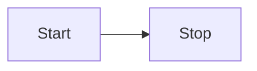
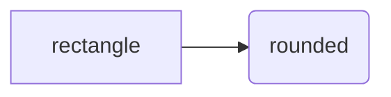
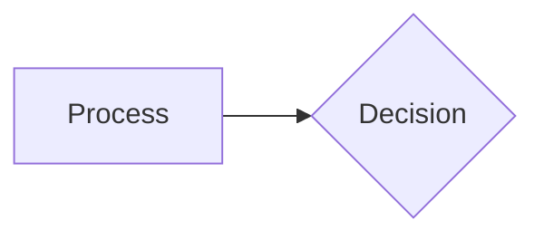
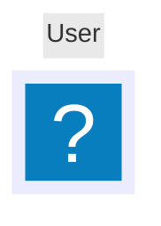
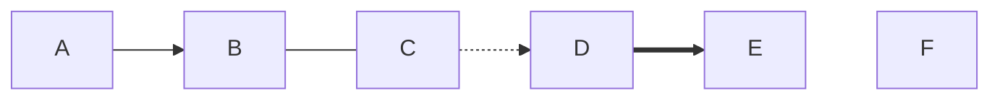
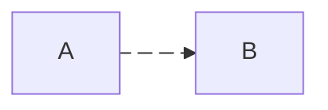
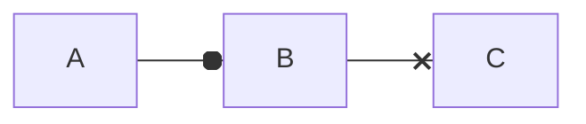
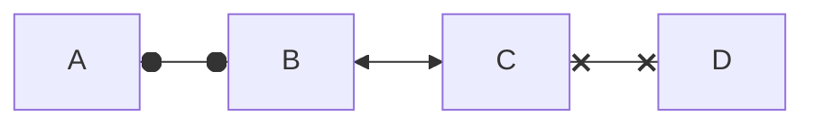
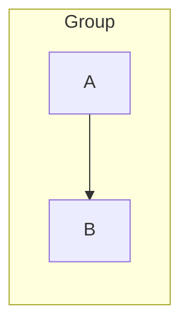

# Mermaid Flowchart（`flowchart` / `graph`）まとめ（このリポジトリ用）

Upstream:

- Docs: https://mermaid.js.org/syntax/flowchart.html
- Source: https://github.com/mermaid-js/mermaid/blob/develop/packages/mermaid/src/docs/syntax/flowchart.md

このファイルは上記ドキュメントの要点だけを整理したものです（サンプルの重複や冗長な説明は省略）。

## まず躓きやすい点（Gotchas）

- ノードのラベルに `end`（小文字）を使うと壊れることがあります。`End` / `END` などにするか、ドキュメントの回避策に従う。
- 接続先ノードの先頭が `o` / `x` だと「circle edge / cross edge」として解釈されることがあります（例: `A---oB`）。先頭にスペースを入れるか、大文字化する。

## 基本



- `flowchart` の代わりに `graph` も使える。
- 方向: `TB`/`TD`（上→下）, `BT`, `LR`, `RL`。

方向キーワード:

- `TB`: top to bottom
- `TD`: top-down（`TB` と同義）
- `BT`: bottom to top
- `LR`: left to right
- `RL`: right to left

### ノード ID と表示ラベル

- `id1[Text]` の `id1` が参照用 ID、`Text` が表示ラベル。
- 同じ ID を複数回ラベル付きで書くと「最後のラベル」が採用される。

### 文字列（Unicode / Markdown）

- Unicode などは `"` で囲める: `id["This ❤ Unicode"]`。
- Markdown 文字列は（設定によって） `` "`...`" `` の形で書ける。
- Markdown 文字列の自動折り返しなどの挙動は「Markdown Strings」節を参照。

## ノード形状（従来の括弧構文）

主な形状（upstream の「Node shapes」節）:



| 形状 | 構文例 |
| --- | --- |
| Rectangle（default） | `id` / `id[Text]` |
| Round edges | `id(Text)` |
| Stadium | `id([Text])` |
| Subroutine | `id[[Text]]` |
| Cylinder / Database | `id[(Database)]` |
| Circle | `id((Text))` |
| Asymmetric | `id>Text]` |
| Rhombus / Diamond | `id{Text}` |
| Hexagon | `id{{Text}}` |
| Parallelogram | `id[/Text/]` |
| Parallelogram alt | `id[\\Text\\]` |
| Trapezoid | `A[/Christmas\\]` |
| Trapezoid alt | `B[\\Go shopping/]` |
| Double circle | `id(((Text)))` |

## Expanded Node Shapes（v11.3.0+）: `@{ ... }` 構文

基本形:



### 新 shape 一覧（Docs の shapesTable 由来）

| Semantic | Shape (visual) | `shape:` short name | Aliases supported | Meaning |
| --- | --- | --- | --- | --- |
| Bang | Bang | `bang` | `bang` | Bang |
| Card | Notched Rectangle | `notch-rect` | `card`, `notched-rectangle` | Represents a card |
| Cloud | Cloud | `cloud` | `cloud` | cloud |
| Collate | Hourglass | `hourglass` | `collate`, `hourglass` | Represents a collate operation |
| Com Link | Lightning Bolt | `bolt` | `com-link`, `lightning-bolt` | Communication link |
| Comment | Curly Brace | `brace` | `brace-l`, `comment` | Adds a comment |
| Comment Right | Curly Brace | `brace-r` |  | Adds a comment |
| Comment with braces on both sides | Curly Braces | `braces` |  | Adds a comment |
| Data Input/Output | Lean Right | `lean-r` | `in-out`, `lean-right` | Represents input or output |
| Data Input/Output | Lean Left | `lean-l` | `lean-left`, `out-in` | Represents output or input |
| Database | Cylinder | `cyl` | `cylinder`, `database`, `db` | Database storage |
| Decision | Diamond | `diam` | `decision`, `diamond`, `question` | Decision-making step |
| Delay | Half-Rounded Rectangle | `delay` | `half-rounded-rectangle` | Represents a delay |
| Direct Access Storage | Horizontal Cylinder | `h-cyl` | `das`, `horizontal-cylinder` | Direct access storage |
| Disk Storage | Lined Cylinder | `lin-cyl` | `disk`, `lined-cylinder` | Disk storage |
| Display | Curved Trapezoid | `curv-trap` | `curved-trapezoid`, `display` | Represents a display |
| Divided Process | Divided Rectangle | `div-rect` | `div-proc`, `divided-process`, `divided-rectangle` | Divided process shape |
| Document | Document | `doc` | `doc`, `document` | Represents a document |
| Event | Rounded Rectangle | `rounded` | `event` | Represents an event |
| Extract | Triangle | `tri` | `extract`, `triangle` | Extraction process |
| Fork/Join | Filled Rectangle | `fork` | `join` | Fork or join in process flow |
| Internal Storage | Window Pane | `win-pane` | `internal-storage`, `window-pane` | Internal storage |
| Junction | Filled Circle | `f-circ` | `filled-circle`, `junction` | Junction point |
| Lined Document | Lined Document | `lin-doc` | `lined-document` | Lined document |
| Lined/Shaded Process | Lined Rectangle | `lin-rect` | `lin-proc`, `lined-process`, `lined-rectangle`, `shaded-process` | Lined process shape |
| Loop Limit | Trapezoidal Pentagon | `notch-pent` | `loop-limit`, `notched-pentagon` | Loop limit step |
| Manual File | Flipped Triangle | `flip-tri` | `flipped-triangle`, `manual-file` | Manual file operation |
| Manual Input | Sloped Rectangle | `sl-rect` | `manual-input`, `sloped-rectangle` | Manual input step |
| Manual Operation | Trapezoid Base Top | `trap-t` | `inv-trapezoid`, `manual`, `trapezoid-top` | Represents a manual task |
| Multi-Document | Stacked Document | `docs` | `documents`, `st-doc`, `stacked-document` | Multiple documents |
| Multi-Process | Stacked Rectangle | `st-rect` | `processes`, `procs`, `stacked-rectangle` | Multiple processes |
| Odd | Odd | `odd` |  | Odd shape |
| Paper Tape | Flag | `flag` | `paper-tape` | Paper tape |
| Prepare Conditional | Hexagon | `hex` | `hexagon`, `prepare` | Preparation or condition step |
| Priority Action | Trapezoid Base Bottom | `trap-b` | `priority`, `trapezoid`, `trapezoid-bottom` | Priority action |
| Process | Rectangle | `rect` | `proc`, `process`, `rectangle` | Standard process shape |
| Start | Circle | `circle` | `circ` | Starting point |
| Start | Small Circle | `sm-circ` | `small-circle`, `start` | Small starting point |
| Stop | Double Circle | `dbl-circ` | `double-circle` | Represents a stop point |
| Stop | Framed Circle | `fr-circ` | `framed-circle`, `stop` | Stop point |
| Stored Data | Bow Tie Rectangle | `bow-rect` | `bow-tie-rectangle`, `stored-data` | Stored data |
| Subprocess | Framed Rectangle | `fr-rect` | `framed-rectangle`, `subproc`, `subprocess`, `subroutine` | Subprocess |
| Summary | Crossed Circle | `cross-circ` | `crossed-circle`, `summary` | Summary |
| Tagged Document | Tagged Document | `tag-doc` | `tag-doc`, `tagged-document` | Tagged document |
| Tagged Process | Tagged Rectangle | `tag-rect` | `tag-proc`, `tagged-process`, `tagged-rectangle` | Tagged process |
| Terminal Point | Stadium | `stadium` | `pill`, `terminal` | Terminal point |
| Text Block | Text Block | `text` |  | Text block |

## Special shapes（v11.3.0+）: icon / image

### icon



- `icon`: 登録済み icon pack のアイコン名（例: `fa:user`）
- `form`: `square` / `circle` / `rounded`（省略すると背景なし）
- `label`, `pos`（`t`/`b`）, `h`（省略時 48）

### image

```mermaid
flowchart TD
  A@{ img: "https://example.com/image.png", label: "Image", pos: "t", h: 60, constraint: "on" }
```

- `img`: 画像 URL
- `w`, `h`: サイズ（省略可）
- `constraint`: `on` でアスペクト比維持（`h` 基準で `w` を調整）

## リンク（エッジ）



- ラベル: `A-- text -->B` / `A---|text|B` / `A-->|text|B`。
- 連鎖: `A --> B --> C`。
- まとめ書き: `a --> b & c --> d` / `A & B --> C & D`。

### Edge ID（エッジに ID を付ける）



- `e1@{ animation: fast }` / `slow` のような shorthand がある。
- `classDef` でエッジをアニメーションさせることもできる。
- `stroke-dasharray` のようにカンマを含む値は `\\,` でエスケープが必要。

### 新しい矢印（circle / cross）



### 多方向矢印



### リンクの最小長（rank）

長さを「要求」するだけなので、レンダラ都合でさらに伸びることがある。
リンクの途中にラベルを書く場合は、追加の `-` / `=` / `.` を「ラベルより右側」に足す。

| Length            |   1    |    2    |    3     |
| --- | :---: | :---: | :---: |
| Normal            | `---`  | `----`  | `-----`  |
| Normal with arrow | `-->`  | `--->`  | `---->`  |
| Thick             | `===`  | `====`  | `=====`  |
| Thick with arrow  | `==>`  | `===>`  | `====>`  |
| Dotted            | `-.-`  | `-..-`  | `-...-`  |
| Dotted with arrow | `-.->` | `-..->` | `-...->` |

## 構文を壊しやすい特殊文字 / エスケープ

- 困る文字は `id1["This is the (text) in the box"]` のように `"` で囲う。
- HTML entity（`#quot;` / `#9829;` など）も使える。
- 数値は 10 進数（例: `#` は `#35;`）。名前付き entity も利用可能。

## Subgraph



- `subgraph id [label]` のように ID を付けられる。
- subgraph 内で `direction TB` などを指定できる。
- subgraph 内ノードが外部とリンクすると、subgraph の direction が無視され親の方向に引きずられる場合がある（upstream の limitation 参照）。

## Markdown Strings（ノード/エッジ/サブグラフのラベル）

- Markdown 文字列は改行や強調を扱いやすく、長文の自動折り返しも行われる。
- 自動折り返しは `config: { markdownAutoWrap: false }` で無効化可能。

## Interaction（click）

```text
click nodeId callback "Tooltip"
click nodeId "https://example.com" "Tooltip" _blank
click nodeId call callback() "Tooltip"
click nodeId href "https://example.com" "Tooltip"
```

- `securityLevel='strict'` では無効、`securityLevel='loose'` では有効（ドキュメント記載）。
- リンクターゲットは `_self` / `_blank` / `_parent` / `_top` をサポート。

## Comments


## Styling / Classes

- ノード: `style id fill:#f9f,stroke:#333,stroke-width:4px`。
- クラス: `classDef name ...` / `class A,B name` / `A:::name`。
- リンク: `linkStyle <index|default> ...`（リンクは定義順 index で指定。`linkStyle 3 ...` は 4 本目）。
- 曲線: diagram-level は `config.flowchart.curve`、edge-level は Edge ID に `e1@{ curve: linear }`（v11.10.0+）。
- 曲線スタイル名: `basis`, `bumpX`, `bumpY`, `cardinal`, `catmullRom`, `linear`, `monotoneX`, `monotoneY`, `natural`, `step`, `stepAfter`, `stepBefore`。

## Font Awesome

- ラベル内で `fa:fa-twitter` のように書ける。
- v11.7.0+ では icon pack 登録に対応（未登録の場合は Font Awesome CSS にフォールバック）。
- カスタムアイコンは `fak:` プレフィックス（Font Awesome 側のキットが必要）。

## スペース / セミコロン

- エッジ定義末尾の `;` は任意。
- 頂点とリンクの間は 1 文字スペースを許容（ただし「頂点とテキスト」「リンクとテキスト」の間には不要なスペースを入れない）。

## Configuration

### Renderer

- 既定レンダラは `dagre`。
- v9.4+ で `elk` を選べる（実験的）。

```yaml
config:
  flowchart:
    defaultRenderer: elk
```

### Width

- `mermaid.flowchartConfig`（または CLI の設定）で幅を調整できる。
- JavaScript で指定する場合は値を文字列にするのが安全（例: `width: "100%"`）。
