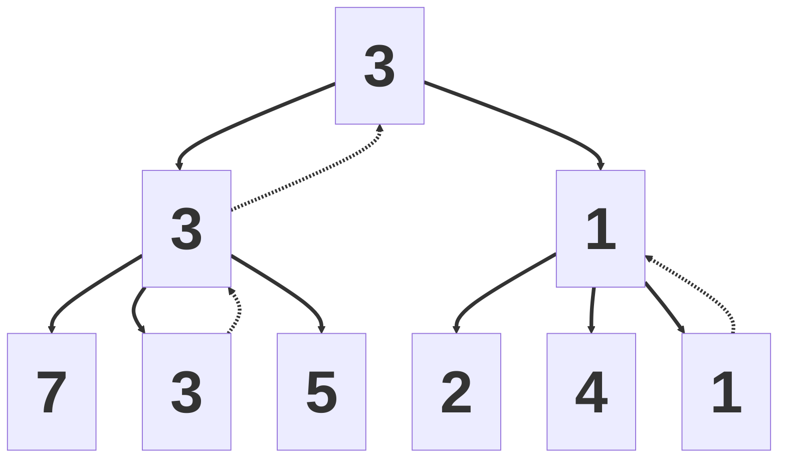
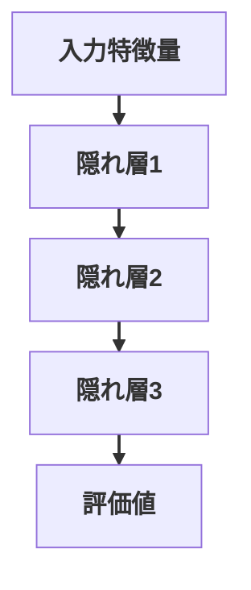
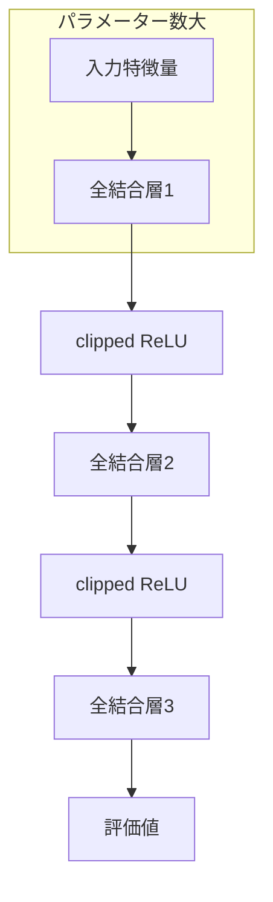

<div class="cover">
  <div class="eyebrow">AI 共創の時代へ - Build with AI Kwansai 2026</div>
  <h1>Coding Agent × 将棋 AI</h1>
  <p class="subtitle">～Coding Agent に将棋 AI を強化してもらった話～</p>
  <div class="meta">
    <div>
      <div>野田 久順</div>
      <div class="muted">ザイオソフト コンピューター将棋サークル</div>
    </div>
    <div class="muted">2026-04-19</div>
  </div>
</div>

---
layout: section
---

# 1. 自己紹介

---
layout: image-right-framed
image: ./public/assets/S0650008697-0024-clipped-Hisayori-Noda.jpg
backgroundSize: contain
columns: 1.8fr 0.2fr
frameMaxWidth: 320px
frameMaxHeight: 280px
---

## 野田 久順

ザイオソフト <NW>コンピューター</NW><NW>将棋</NW><NW>サークル</NW><NW>所属</NW>

### 主な実績
- 2017年 <NW>第5回</NW><NW>将棋</NW><NW>電王</NW><NW>トーナメント</NW> <NW>優勝</NW>
- 2021年 <NW>CSA</NW><NW>貢献賞</NW> <NW>受賞</NW>
- 2024年 <NW>第34回</NW><NW>世界</NW><NW>コンピュータ</NW><NW>将棋</NW><NW>選手権</NW> <NW>優勝</NW>
---
layout: center
---

## 今日持ち帰ってほしいこと

1. todo(nodchip): スライド全体を作ってからあとで埋める
2. 
3. 

---
layout: two-cols
---

## この発表の流れ

::left::
- 2. todo(nodchip): スライド全体を作ってからあとで埋める
- 3. 
- 4. 

::right::
- 5. 
- 6. 

---
layout: section
---

# 2. 課題

---
layout: image-right-framed
image: ./public/assets/2026-02-27-111526.png
backgroundSize: contain
columns: 1fr 380px
frameMaxWidth: 320px
frameMaxHeight: 260px
---

## 将棋 AI

- <NW>将棋を</NW><NW>指す</NW><NW>ソフトウェア</NW>
- <NW>局面を</NW><NW>入力すると、</NW><NW>推奨手と</NW><NW>評価値を</NW><NW>提示</NW>
  - <NW>推奨手:</NW> <NW>次に</NW><NW>指すべき手</NW>
  - <NW>評価値:</NW> <NW>先手・後手の</NW><NW>有利さを</NW><NW>示す</NW><NW>数値</NW>

::right::
[ShogiHome](https://sunfish-shogi.github.io/shogihome/)

---
layout: two-cols
class: game-tree
---

## ゲーム木

::left::
- <NW>合法手に</NW><NW>基づいて、</NW><NW>局面遷移を</NW><NW>木構造で</NW><NW>表したもの</NW>
- <NW>ゲームの</NW><NW>状態遷移を</NW><NW>原理的に</NW><NW>すべて</NW><NW>表現できる</NW>
- <NW>すべての</NW><NW>分岐を</NW><NW>調べ切ると、</NW><NW>最善手同士の</NW><NW>結果を</NW><NW>特定できる</NW>
- <NW>この</NW><NW>過程を</NW><NW>「ゲームを解く」</NW><NW>と呼ぶ</NW>

::right::

```mermaid
%%{init: {'flowchart': {'useMaxWidth': true}}}%%
flowchart TD
  A@{ img: "/assets/image4.png", h: 110, constraint: "on" } --> B1@{ img: "/assets/image6.png", h: 110, constraint: "on" }
  A --> B2@{ img: "/assets/image5.png", h: 110, constraint: "on" }
  B1 --> C1@{ img: "/assets/image8.png", h: 110, constraint: "on" }
  B1 --> C2@{ img: "/assets/image7.png", h: 110, constraint: "on" }
  B2 --> C3[...]
  C1 --> D1@{ img: "/assets/image9.png", h: 110, constraint: "on" }
  C1 --> D2@{ img: "/assets/image10.png", h: 110, constraint: "on" }
  C2 --> D3[...]
  D1 --> E1[...]
  D2 --> E2[...]

  linkStyle default stroke-width:2px;
```
---
layout: two-cols
class: game-complexity
---

## 探索量から見たゲームの複雑さ

::left::
- <NW>ゲームを</NW><NW>解くための</NW><NW>探索局面数は、</NW><NW>複雑さの</NW><NW>目安になる</NW>
- <NW>探索局面数</NW><NW>≒</NW><NW>N<sup>M</sup></NW>
  - <NW>N:</NW><NW>平均合法手数</NW>
  - <NW>M:</NW><NW>平均終了手数</NW>
- <NW>複雑な</NW><NW>ゲームでは、</NW><NW>現実的な</NW><NW>時間内に</NW><NW>全探索は</NW><NW>不可能</NW>

::right::

| ゲーム | 探索局面数 |
| --- | --- |
| チェッカー | 10<sup>30</sup> |
| オセロ | 10<sup>60</sup> |
| チェス | 10<sup>120</sup> |
| 中国象棋 | 10<sup>150</sup> |
| 将棋 | 10<sup>220</sup> |
| 囲碁 | 10<sup>360</sup> |

---
layout: two-cols
class: search-eval
---

## 探索と評価

::left::
- <NW>一定の</NW><NW>手数まで</NW><NW>「探索」し、</NW><NW>到達局面を</NW><NW>「評価」する</NW>
  - <NW>探索:</NW> <NW>人間の</NW><NW>「読み」に</NW><NW>相当</NW>
  - <NW>評価:</NW> <NW>人間の</NW><NW>「大局観」に</NW><NW>相当</NW>

::right::



<div style="text-align:center; margin-top: 10px; font-size: 18px; line-height: 1.25">
  <NW>□:</NW> <NW>局面</NW><br>
  <NW>□の中の数字:</NW> <NW>評価値</NW><br>
  <NW>実線:</NW> <NW>差し手（遷移）</NW><br>
  <NW>破線:</NW> <NW>評価値の伝搬</NW><br>
  <NW>左側の</NW><NW>状態に</NW><NW>遷移する</NW><NW>手が</NW><NW>最善</NW><br>
  <NW>この時の</NW><NW>評価値は</NW><NW>3</NW>
</div>

---
layout: center
class: cpu-gpu
---

## CPU エンジンと GPU エンジン

| 項目 | CPUエンジン | GPUエンジン |
| --- | --- | --- |
| 探索アルゴリズム | アルファ・ベータ法 | PUCT |
| 評価関数 | NNUE評価関数 | ディープラーニング評価関数 |
| 探索速度 | 速い | 遅い |
| 評価精度 | 低い | 高い |
| 特異な局面 | 終盤 | 序盤 |
| 主な将棋AI | やねうら王・水匠・tanuki- | dlshogi |

---
layout: two-cols
class: nnue
---

## NNUE 評価関数

::left::

- ディープラーニングベースの評価関数
- CPU による高速な推論
- 全結合ニューラルネットワーク
- 活性関数に Clipped ReLU を使用
- 差分計算による効率化
- 手番の考慮
- HalfKP 特徴量
- 整数 SIMD 演算による高速化

::right::



---
layout: two-cols
---

## HalfKP 特徴量

::left::
- 盤面を「玉の位置」と「それ以外の1駒」の組で表す特徴
- 1手で変わる要素が少なく、差分更新に向く
- 高次元だがスパース（ほぼ0）なので計算を軽くできる

::right::

{.halfkp-photo}

玉と玉以外の1駒の組み合わせの例
盤面上に存在するすべての組み合わせを One-hot 化して足し合わせる

---
layout: two-cols
---

## パラメーター数の偏り

::left::
- 全結合層1 まではパラメーター数大
- 全結合層1 以降はパラメーター数小

::right::



---
layout: center
---

## SFNN（Stockfish側のNNUE構成）

- NNUE系の代表的な構成例（Stockfishで使われている）
- 手番側と相手側の2視点を分けて処理し、最後に合成
- 大きな最初の層＋小さな後段層で、スパース入力を活かす
- 低精度整数演算（量子化）で、CPU上の高速化を重視

参考: https://official-stockfish.github.io/docs/nnue-pytorch-wiki/docs/nnue.html

---
layout: section
---

# 3. 方針（Agent採用理由）

---
layout: center
---

## なぜ Coding Agent を使うか

- 実装だけでなく検証ループまで自動化できる
- 試行回数を増やし、改善速度を上げられる
- 指示テンプレ化で再現性を確保できる

---
layout: section
---

# 4. 実行プロセス

---
layout: center
---

## 1サイクルの進め方

1. 目的と制約を明示して依頼
2. 実装差分を確認
3. ベンチ・対局・回帰で検証
4. 結果を踏まえて次の改善へ

---
layout: section
---

# 5. 結果

---
layout: center
---

## 結果（速度・強さ・品質）

- 速度: ベンチで改善を確認
- 強さ: 対局結果で改善を確認
- 品質: 回帰テストで破壊的変更を抑制

---
layout: section
---

# 6. 再現可能な運用ルール（まとめ）

---
layout: center
---

## まとめ

- Agent は「計測→改善→回帰」まで自動化すると真価が出る
- 将棋 AI は変更影響が大きいので、検証が最重要
- 指示テンプレを用意して共創の速度を上げる
---
layout: end
---

ありがとうございました


