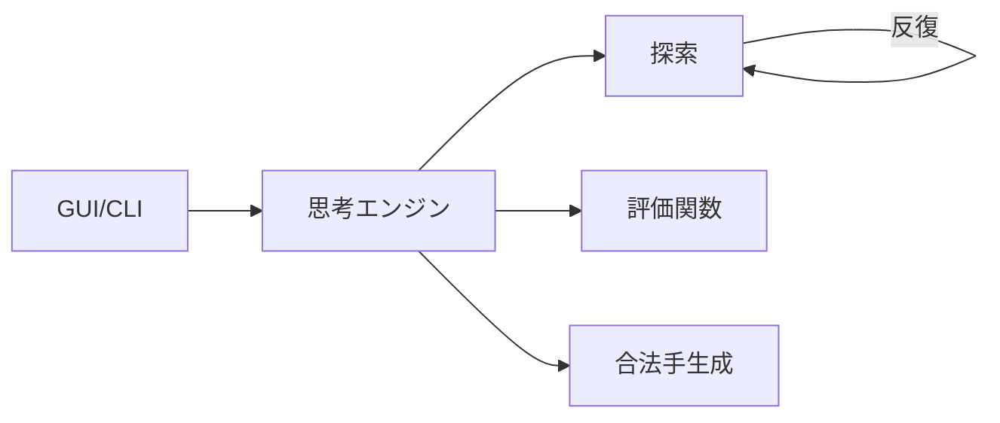

  
AI 共創の時代へ - Build with AI Kwansai 2026

  <h1>Coding Agent × 将棋 AI</h1>
  
～Coding Agent に将棋 AI を強化してもらった話～

  

    

      
野田 久順

      
ザイオソフト コンピューター将棋サークル

    

    
2026-04-19

  

---
layout: section
---

# 自己紹介

---
layout: two-cols
---

::left::
## 野田 久順（ひさより）

ザイオソフト コンピューター将棋サークル所属

### 主な実績
- 2017年 第5回将棋電王トーナメント 優勝
- 2021年 CSA貢献賞 受賞
- 2024年 第34回世界コンピュータ将棋選手権 優勝

::right::

{.intro-photo}
---
layout: center
---

## 今日持ち帰ってほしいこと

1. Coding Agent は「実装」だけでなく「検証・反復」まで強い
2. 強化の鍵は、**依頼の型**と**証拠（再現可能性）**
3. 将棋 AI でも、設計/実験/可視化を自動化すると伸びる

---
layout: two-cols
---

## この発表の流れ

::left::
- 2. 課題（将棋 AI の前提と痛み）
- 3. 方針（Agent採用理由）
- 4. 実行プロセス（指示→実装→検証）

::right::
- 5. 結果（速度・強さ・品質）
- 6. 再現可能な運用ルール
- デモ（できれば）

---
layout: section
---

# 2. 課題

---
layout: center
---

## 課題の全体像（将棋 AI）

---
layout: section
---

# 3. 方針（Agent採用理由）

---
layout: center
---

## なぜ Coding Agent を使うか

- 実装だけでなく検証ループまで自動化できる
- 試行回数を増やし、改善速度を上げられる
- 指示テンプレ化で再現性を確保できる

---
layout: section
---

# 4. 実行プロセス

---
layout: center
---

## 1サイクルの進め方

1. 目的と制約を明示して依頼
2. 実装差分を確認
3. ベンチ・対局・回帰で検証
4. 結果を踏まえて次の改善へ

---
layout: section
---

# 5. 結果

---
layout: center
---

## 結果（速度・強さ・品質）

- 速度: ベンチで改善を確認
- 強さ: 対局結果で改善を確認
- 品質: 回帰テストで破壊的変更を抑制

---
layout: section
---

# 6. 再現可能な運用ルール（まとめ）

---
layout: center
---

## まとめ

- Agent は「計測→改善→回帰」まで自動化すると真価が出る
- 将棋 AI は変更影響が大きいので、検証が最重要
- 指示テンプレを用意して共創の速度を上げる
---
layout: end
---

ありがとうございました

