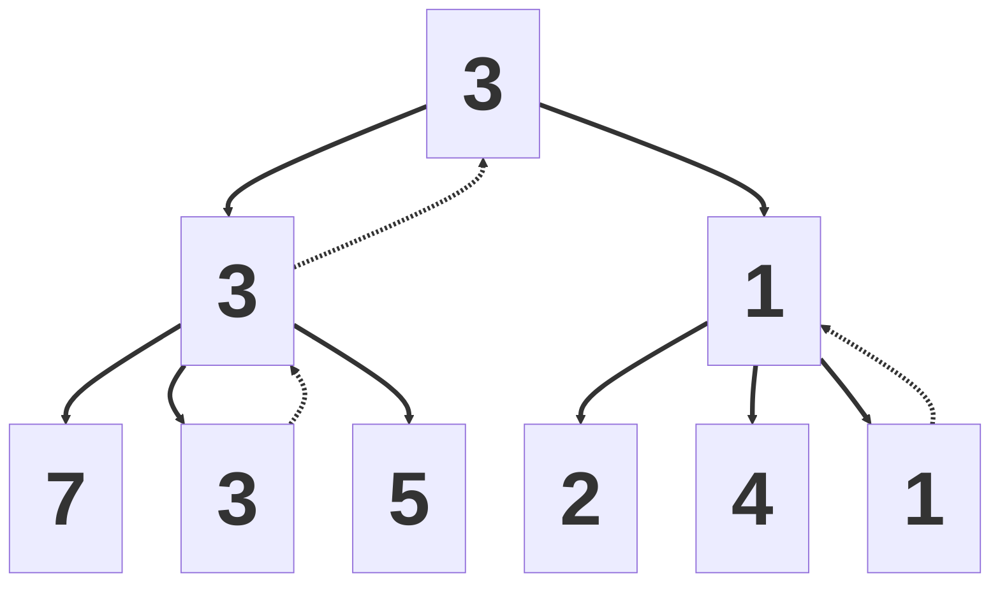
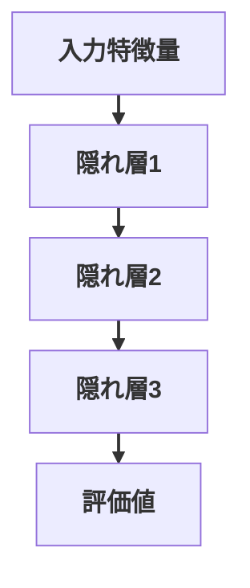
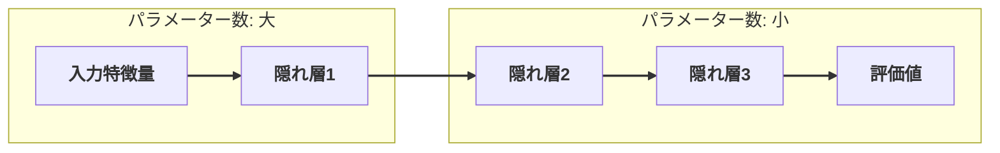
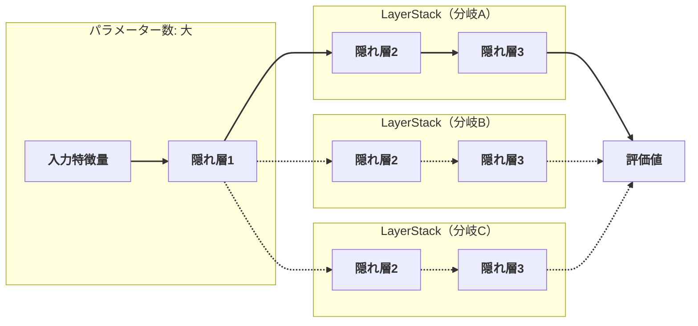

<div class="cover">
  <div class="eyebrow">AI 共創の時代へ - Build with AI Kwansai 2026</div>
  <h1>Coding Agent × 将棋 AI</h1>
  <p class="subtitle">～Coding Agent に将棋 AI を強化してもらった話～</p>
  <div class="meta">
    <div>
      <div>野田 久順</div>
      <div class="muted">ザイオソフト コンピューター将棋サークル</div>
    </div>
    <div class="muted">2026-04-19</div>
  </div>
</div>

---
layout: section
---

# 1. 自己紹介

---
layout: image-right-framed
image: ./public/assets/S0650008697-0024-clipped-Hisayori-Noda.jpg
backgroundSize: contain
columns: 1.8fr 0.2fr
frameMaxWidth: 320px
frameMaxHeight: 280px
---

## 野田 久順

ザイオソフト <NW>コンピューター</NW><NW>将棋</NW><NW>サークル</NW><NW>所属</NW>

### 主な実績
- 2017年 <NW>第5回</NW><NW>将棋</NW><NW>電王</NW><NW>トーナメント</NW> <NW>優勝</NW>
- 2021年 <NW>CSA</NW><NW>貢献賞</NW> <NW>受賞</NW>
- 2024年 <NW>第34回</NW><NW>世界</NW><NW>コンピュータ</NW><NW>将棋</NW><NW>選手権</NW> <NW>優勝</NW>
---
layout: center
---

## 今日持ち帰ってほしいこと

1. todo(nodchip): スライド全体を作ってからあとで埋める
2. 
3. 

---
layout: two-cols
---

## この発表の流れ

::left::
- 2. todo(nodchip): スライド全体を作ってからあとで埋める
- 3. 
- 4. 

::right::
- 5. 
- 6. 

---
layout: section
---

# 2. 将棋 AI

---
layout: image-right-framed
image: ./public/assets/2026-02-27-111526.png
backgroundSize: contain
columns: 1fr 380px
frameMaxWidth: 320px
frameMaxHeight: 260px
---

## 将棋 AI

- <NW>将棋を</NW><NW>指す</NW><NW>ソフトウェア</NW>
- <NW>局面を</NW><NW>入力すると、</NW><NW>推奨手と</NW><NW>評価値を</NW><NW>提示</NW>
  - <NW>推奨手:</NW> <NW>次に</NW><NW>指すべき手</NW>
  - <NW>評価値:</NW> <NW>先手・後手の</NW><NW>有利さを</NW><NW>示す</NW><NW>数値</NW>

::right::
[ShogiHome](https://sunfish-shogi.github.io/shogihome/)

---
layout: two-cols
class: game-tree
---

## ゲーム木

::left::
- <NW>合法手に</NW><NW>基づいて、</NW><NW>局面遷移を</NW><NW>木構造で</NW><NW>表したもの</NW>
- <NW>ゲームの</NW><NW>状態遷移を</NW><NW>原理的に</NW><NW>すべて</NW><NW>表現できる</NW>
- <NW>すべての</NW><NW>分岐を</NW><NW>調べ切ると、</NW><NW>最善手同士の</NW><NW>結果を</NW><NW>特定できる</NW>
- <NW>この</NW><NW>過程を</NW><NW>「ゲームを解く」</NW><NW>と呼ぶ</NW>

::right::

```mermaid
%%{init: {'flowchart': {'useMaxWidth': true}}}%%
flowchart TD
  A@{ img: "/assets/image4.png", h: 110, constraint: "on" } --> B1@{ img: "/assets/image6.png", h: 110, constraint: "on" }
  A --> B2@{ img: "/assets/image5.png", h: 110, constraint: "on" }
  B1 --> C1@{ img: "/assets/image8.png", h: 110, constraint: "on" }
  B1 --> C2@{ img: "/assets/image7.png", h: 110, constraint: "on" }
  B2 --> C3[...]
  C1 --> D1@{ img: "/assets/image9.png", h: 110, constraint: "on" }
  C1 --> D2@{ img: "/assets/image10.png", h: 110, constraint: "on" }
  C2 --> D3[...]
  D1 --> E1[...]
  D2 --> E2[...]

  linkStyle default stroke-width:2px;
```
---
layout: two-cols
class: game-complexity
---

## 探索量から見たゲームの複雑さ

::left::
- <NW>ゲームを</NW><NW>解くための</NW><NW>探索局面数は、</NW><NW>複雑さの</NW><NW>目安になる</NW>
- <NW>探索局面数</NW><NW>≒</NW><NW>N<sup>M</sup></NW>
  - <NW>N:</NW><NW>平均合法手数</NW>
  - <NW>M:</NW><NW>平均終了手数</NW>
- <NW>複雑な</NW><NW>ゲームでは、</NW><NW>現実的な</NW><NW>時間内に</NW><NW>全探索は</NW><NW>不可能</NW>

::right::

| ゲーム | 探索局面数 |
| --- | --- |
| チェッカー | 10<sup>30</sup> |
| オセロ | 10<sup>60</sup> |
| チェス | 10<sup>120</sup> |
| 中国象棋 | 10<sup>150</sup> |
| 将棋 | 10<sup>220</sup> |
| 囲碁 | 10<sup>360</sup> |

---
layout: two-cols
class: search-eval
---

## 探索と評価

::left::
- <NW>一定の</NW><NW>手数まで</NW><NW>「探索」し、</NW><NW>到達局面を</NW><NW>「評価」する</NW>
  - <NW>探索:</NW> <NW>人間の</NW><NW>「読み」に</NW><NW>相当</NW>
  - <NW>評価:</NW> <NW>人間の</NW><NW>「大局観」に</NW><NW>相当</NW>

::right::



<div style="text-align:center; margin-top: 10px; font-size: 18px; line-height: 1.25">
  <NW>□:</NW> <NW>局面</NW><br>
  <NW>□の中の数字:</NW> <NW>評価値</NW><br>
  <NW>実線:</NW> <NW>差し手（遷移）</NW><br>
  <NW>破線:</NW> <NW>評価値の伝搬</NW><br>
  <NW>左側の</NW><NW>状態に</NW><NW>遷移する</NW><NW>手が</NW><NW>最善</NW><br>
  <NW>この時の</NW><NW>評価値は</NW><NW>3</NW>
</div>

---
layout: center
class: cpu-gpu
---

## CPU エンジンと GPU エンジン

| 項目 | CPUエンジン | GPUエンジン |
| --- | --- | --- |
| 探索アルゴリズム | アルファ・ベータ法 | PUCT |
| 評価関数 | NNUE評価関数 | ディープラーニング評価関数 |
| 探索速度 | 速い | 遅い |
| 評価精度 | 低い | 高い |
| 特異な局面 | 終盤 | 序盤 |
| 主な将棋AI | やねうら王・水匠・tanuki- | dlshogi |

---
layout: two-cols
class: nnue
---

## NNUE 評価関数

::left::

- ディープラーニングベースの評価関数
- CPU による高速な推論
- 全結合ニューラルネットワーク
- 活性関数に Clipped ReLU を使用
- 差分計算による効率化
- 手番の考慮
- HalfKP 特徴量
- 整数 SIMD 演算による高速化

::right::


---
layout: two-cols
class: halfkp
---

## HalfKP 特徴量

::left::
- <NW>盤面を</NW><NW>「玉の位置」と</NW><NW>「それ以外の1駒」の組で</NW><NW>表す</NW><NW>特徴</NW>
- <NW>1手で</NW><NW>変わる</NW><NW>要素が</NW><NW>少なく、</NW><NW>差分更新に</NW><NW>向く</NW>
- <NW>高次元だが</NW><NW>スパース（ほぼ0）なので</NW><NW>計算を</NW><NW>軽くできる</NW>

::right::

{.halfkp-photo}

<div class="halfkp-caption">
<NW>玉と</NW><NW>玉以外の</NW><NW>駒 1 つの</NW><NW>組み合わせの</NW><NW>例</NW><br>
<NW>盤面上に</NW><NW>存在する</NW><NW>すべての</NW><NW>組み合わせを</NW><NW>One-hot</NW><NW>化して</NW><NW>足し合わせる</NW>
</div>

---
layout: center
class: params-bias
---

## パラメーター数の偏り

<div class="params-bias-desc">
<ul>
  <li>全結合層1 まではパラメーター数: 大</li>
  <li>全結合層2 以降はパラメーター数: 小</li>
</ul>
</div>

<div class="params-bias-diag">



</div>

---
layout: two-cols
class: sfnn
---

## SFNN

::left::

- <NW>Stockfish</NW> <NW>チームによる</NW><NW>改良版</NW>
  - <NW>Stockfish:</NW> <NW>世界最強の</NW><NW>チェス</NW> <NW>AI</NW>
- <NW>HalfKAv2_hm</NW> <NW>特徴量</NW>
- <NW>Full_Threats</NW> <NW>特徴量</NW>
- <NW>Feature Transformer</NW> <NW>の一部の直接出力</NW>
- <NW>LayerStack</NW>
- <NW>Element-wise</NW> <NW>multiply</NW>
- <NW>SqrClippedReLU</NW>

::right::

{.sfnn-arch}

[NNUE | Stockfish Docs](https://official-stockfish.github.io/docs/nnue-pytorch-wiki/docs/nnue.html){.sfnn-link}

---
layout: center
class: params-bias
---

## LayerStack

<div class="params-bias-desc">
<ul>
  <li>隠れ層 2 層以降を複数用意し、状況に応じて切り替える</li>
</ul>
</div>

<div class="params-bias-diag">



</div>

---
layout: section
---

# 3. 課題

---
layout: center
---

## LayerStack の切り替え基準

- <NW>チェス</NW> <NW>AI</NW> <NW>は</NW><NW>残り駒数で</NW><NW>切り替える</NW>
  - <NW>残り駒数で</NW><NW>進行度が</NW><NW>推定できる</NW>
  - <NW>進行度を</NW> <NW>8</NW> <NW>段階に</NW><NW>分けて</NW> <NW>LayerStack</NW> <NW>を</NW><NW>切り替える</NW>
- <NW>将棋は</NW><NW>局面の</NW><NW>駒数が</NW><NW>常に</NW><NW>一定</NW> <NW>→</NW> <NW>残り駒数から</NW><NW>進行度が</NW><NW>推定できない</NW>

---
layout: center
---

## 既存の実装

- <NW>玉の</NW><NW>段数の</NW><NW>組み合わせで</NW><NW>切り替える</NW>
  - <NW>｛先手玉 1～3・4～6・7～9 段目｝</NW><NW>×</NW><NW>｛後手玉 1～3・4～6・7～9 段目｝</NW><NW>の</NW> <NW>9</NW> <NW>通り</NW>
- <NW>1～3</NW><NW>×</NW><NW>1～3</NW> <NW>に</NW><NW>偏る</NW>

---
layout: section
---

# 4. 解決方法

---
layout: center
---

## 進行度推定の別アプローチ

- <NW>ロジスティック回帰で</NW><NW>進行度</NW><NW>（0.0～1.0）を</NW><NW>推定して</NW><NW>組み込む</NW>
  - <NW>入力：</NW><NW>KP</NW> <NW>特徴量</NW>
  - <NW>出力：</NW><NW>進行度</NW><NW>（0.0～1.0）</NW>
  - <NW>進行度を</NW> <NW>8</NW> <NW>段階に</NW><NW>量子化し、</NW> <NW>LayerStack</NW> <NW>を</NW><NW>切り替える</NW>
- <NW>激指・技巧</NW> <NW>などが</NW><NW>採用</NW>

---
layout: center
---

## Copilot Coding による実装

- <NW>人間が</NW><NW>主導</NW><NW>し、</NW><NW>AIは</NW><NW>補完・提案・リファクタを</NW><NW>支援</NW>
- <NW>1行</NW><NW>／</NW><NW>1ブロック</NW><NW>単位で</NW><NW>実装・修正</NW>
- <NW>人間と</NW><NW>AIが</NW><NW>対話しながら</NW><NW>補完を</NW><NW>進める</NW>
- <NW>AIは</NW><NW>補助役</NW><NW>（自律的な</NW><NW>計画や</NW><NW>実装は</NW><NW>しない）</NW>

---
layout: center
---

## 使用したツール

- <NW>OpenAI</NW> <NW>Codex</NW>
- <NW>GPT-5.3-Codex</NW>
- <NW>VSCode</NW> <NW>拡張機能</NW>
- <NW>superpowers</NW><NW>（定型手順・安全ルール集）</NW>

---
layout: center
---

## ドメイン理解を依頼する

- <NW>自分</NW><NW>：</NW><NW>「やねうら王の</NW><NW>ソースコードを</NW><NW>読んで、</NW><NW>全体像を</NW><NW>理解してください」</NW>
- <NW>Codex</NW><NW>：</NW><NW>「理解しました」</NW>

---
layout: center
---

## NNUE 評価関数に組み込めるか尋ねる

- 自分「NNUE 評価関数を改造し、入力特徴量から進行度を推定し、レイヤースタックの切り替えをしたいです。」
- Codex「お勧めしません。バックプロパゲーションの連鎖律が切れ、学習が不安定になります。」

---
layout: center
---

## 既存の進行度推定ロジックを組み込めるか尋ねる

- 自分「tanuki_progress.cpp を組み込み、その推定結果を NNUE 評価関数に入力し、レイヤースタックの切り替えに使えますか？」
- Codex「組み込めます。」
- 自分「お願いします。」
- Codex「できました。」

---
layout: center
---

## 量子化による高速化

- 自分「高速化のため、パラメーターを量子化してください。」
- Codex「できました。」

---
layout: center
---

## 差分計算による高速化

- 自分「高速化のため、差分計算を実装してください。」
- Codex「できました。」

---
layout: center
---

## テーブル化による高速化

- 自分「高速化のため、ロジスティック回帰において、シグモイド関数の計算を用に行わず、量子化した計算からテーブル引きで直接レイヤースタックのインデックスを計算するようにしてください。」
- Codex「できました。」

---
layout: center
---

## 目視による確認

```c++
inline bool is_valid_bona_piece(int value) {
    return value >= 0 && value < static_cast<int>(YaneuraOu::Eval::fe_end);
}

inline int32_t contribution(YaneuraOu::Square sq, int bona_piece) {
    if (!is_valid_bona_piece(bona_piece)) return 0;
    return g_weights_q16[sq][bona_piece];
}
```

- 自分「is_valid_bona_piece() によるアサーションを取り除いてください。」
- Codex「できました。」

---
layout: center
---

## 目視による確認

```c++
// logit((i+1)/8) を Q16.16 に丸めた閾値
static constexpr int32_t kThresholdsQ16[7] = {
    -127527, -71999, -33477, 0, 33477, 71999, 127527,
};

int table_index_linear_q16(int64_t sum_q16) {
    int idx = 0;
    while (idx < 7 && sum_q16 >= kThresholdsQ16[idx]) {
        ++idx;
    }
    return idx;
}
```

- 自分「is_valid_bona_piece() によるアサーションを取り除いてください。」
- Codex「できました。」

---
layout: center
---

## 目視による確認

```c++
// logit((i+1)/8) を Q16.16 に丸めた閾値
static constexpr int32_t kThresholdsQ16[7] = {
    -127527, -71999, -33477, 0, 33477, 71999, 127527,
};

int table_index_linear_q16(int64_t sum_q16) {
    int idx = 0;
    while (idx < 7 && sum_q16 >= kThresholdsQ16[idx]) {
        ++idx;
    }
    return idx;
}
```

- 自分「kThresholdsQ16 に番兵を置き、 idx < 7 を取り除いてください」
- Codex「できました。」

---
layout: center
---

## 目視による確認

```c++
// レイヤースタックの選択。Tanuki::Progressが直接indexを返す。
static int stack_index_for_nnue(const Position& pos) {
    int idx = Tanuki::Progress::LayerStackIndex(pos);
    if (idx < 0) idx = 0;
    if (idx >= kLayerStacks) idx = kLayerStacks - 1;
    return idx;
}
```

- 自分「Tanuki::Progress::LayerStackIndex() からは 0～7 までの値しか返らないため、クランプ処理を取り除いてください。」
- Codex「できました。」

---
layout: section
---

# 5. 結果

---
layout: center
---

## 強さ

- レーティング R30.72 向上 (勝率 54.4%)

- 計測環境
  - CPU: AMD Thread Ripper 3990X
  - メモリー: 128 GB 
  - 計測フレームワーク: ShogiBench SPRT

---
layout: center
---

## 速さ

| 比較 | 比較元 平均値 | 比較先 平均値 | 変化率 |
| --- | ---: | ---: | ---: |
| 量子化後 | 7,361,846 | 7,371,596 | +0.132% |
| 差分計算後 | 7,371,596 | 7,361,672 | -0.135% |
| 差分計算後 | 7,371,596 | 7,361,672 | -0.135% |
| テーブル引き後 | 7,361,672 | 7,401,393 | +0.540% |
| コード削除後 | 7,401,393 | 7,578,576 | +1.024% |

- 計測環境
  - CPU: Intel 12900K
  - メモリー: 64 GB
  - コマンド: bench 1024 23 15000 default movetime
  - 5 回計測した平均値

---
layout: section
---

# 6. まとめ

---
layout: center
---

## まとめ

- SFNN のレイヤースタックの選択に、ロジスティック回帰を用いた進行度を使用するようにした。
- 実装に Coding Agent を用いた。
- レーティングが R30.72 向上 (勝率 54.4%) した。
- 

---
layout: end
---

ありがとうございました