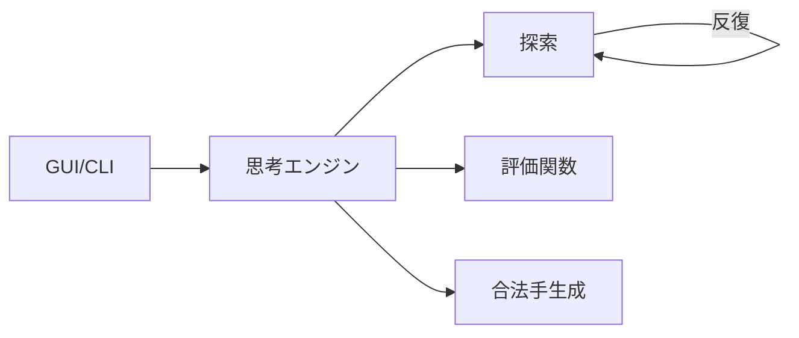

<div class="cover">
  <div class="eyebrow">AI 共創の時代へ - Build with AI Kwansai 2026</div>
  <h1>Coding Agent × 将棋 AI</h1>
  <p class="subtitle">～Coding Agent に将棋 AI を強化してもらった話～</p>
  <div class="meta">
    <div>
      <div>野田 久順</div>
      <div class="muted">ザイオソフト コンピューター将棋サークル</div>
    </div>
    <div class="muted">2026-04-19</div>
  </div>
</div>

---
layout: center
---

## 今日持ち帰ってほしいこと

1. Coding Agent は「実装」だけでなく「検証・反復」まで強い
2. 強化の鍵は、**依頼の型**と**証拠（再現可能性）**
3. 将棋 AI でも、設計/実験/可視化を自動化すると伸びる

---
layout: two-cols
---

## この発表の流れ

::left::
- 背景：将棋 AI の構成と課題
- 何を Agent に頼んだか
- どう検証したか（ベンチ・対局・回帰）

::right::
- 伸びたところ / 伸びなかったところ
- 指示テンプレ（コピペ可）
- デモ（できれば）

---
layout: section
---

# 1. 背景

---
layout: center
---

## 将棋 AI のざっくり構成（例）



---
layout: section
---

# 2. Agent に頼んだこと

---
layout: center
---

## 依頼の型（例）

```md
目的:
制約:
やってほしいこと:
完了条件:
検証コマンド:
```

---
layout: section
---

# 3. 検証

---
layout: center
---

## “伸びた”を証拠で残す

- ベンチ（速度）
- 対局（強さ）
- 回帰テスト（品質）

---
layout: section
---

# 4. まとめ

---
layout: center
---

## まとめ

- Agent は「計測→改善→回帰」まで自動化すると真価が出る
- 将棋 AI は変更影響が大きいので、検証が最重要
- 指示テンプレを用意して共創の速度を上げる

---
layout: end
---

ありがとうございました

