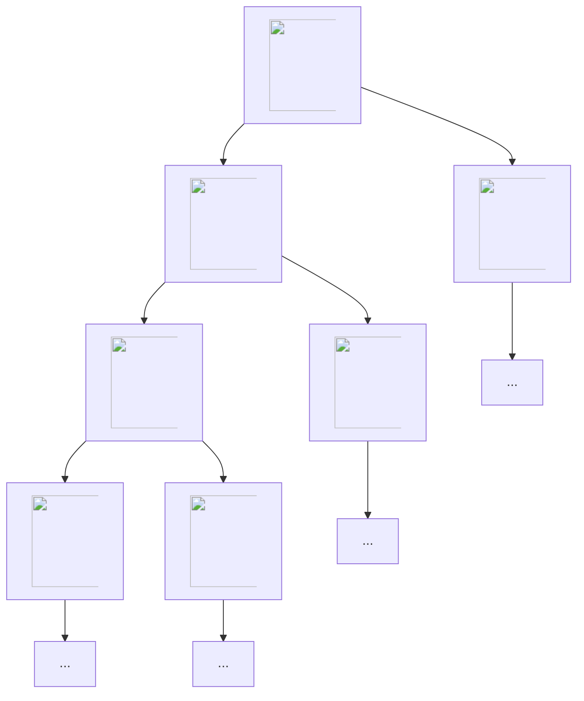
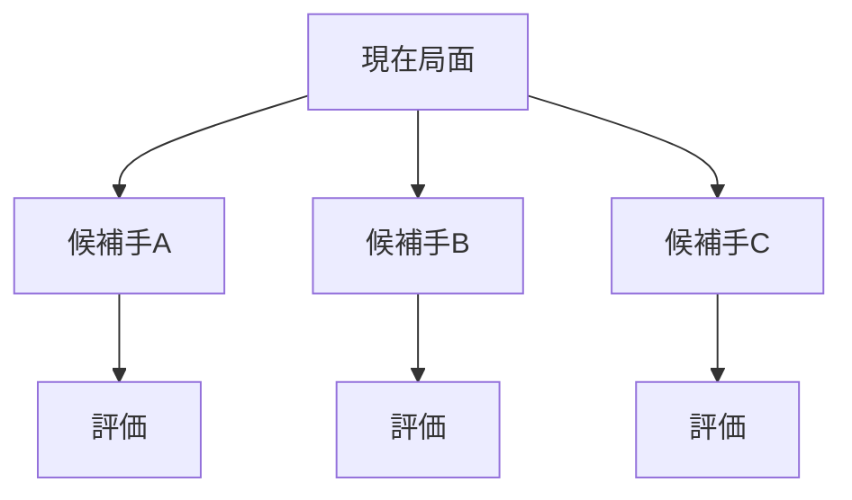
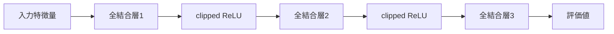

  
AI 共創の時代へ - Build with AI Kwansai 2026

  <h1>Coding Agent × 将棋 AI</h1>
  
～Coding Agent に将棋 AI を強化してもらった話～

  

    

      
野田 久順

      
ザイオソフト コンピューター将棋サークル

    

    
2026-04-19

  

---
layout: section
---

# 1. 自己紹介

---
layout: image-right-framed
image: ./public/assets/S0650008697-0024-clipped-Hisayori-Noda.jpg
backgroundSize: contain
columns: 1.8fr 0.2fr
frameMaxWidth: 320px
frameMaxHeight: 280px
---

## 野田 久順

ザイオソフト <NW>コンピューター</NW><NW>将棋</NW><NW>サークル</NW>所属

### 主な実績
- 2017年 <NW>第5回</NW><NW>将棋</NW><NW>電王</NW><NW>トーナメント</NW> <NW>優勝</NW>
- 2021年 <NW>CSA</NW><NW>貢献賞</NW> <NW>受賞</NW>
- 2024年 <NW>第34回</NW><NW>世界</NW><NW>コンピュータ</NW><NW>将棋</NW><NW>選手権</NW> <NW>優勝</NW>
---
layout: center
---

## 今日持ち帰ってほしいこと

1. todo(nodchip): スライド全体を作ってからあとで埋める
2. 
3. 

---
layout: two-cols
---

## この発表の流れ

::left::
- 2. todo(nodchip): スライド全体を作ってからあとで埋める
- 3. 
- 4. 

::right::
- 5. 
- 6. 

---
layout: section
---

# 2. 課題

---
layout: image-right-framed
image: ./public/assets/2026-02-27-111526.png
backgroundSize: contain
columns: 1fr 380px
frameMaxWidth: 320px
frameMaxHeight: 260px
---

## 将棋 AI

- <NW>将棋を</NW><NW>指す</NW><NW>ソフトウェア</NW>
- <NW>局面を</NW><NW>入力すると、</NW><NW>推奨手と</NW><NW>評価値を</NW><NW>提示</NW>
  - <NW>推奨手:</NW>　<NW>次に</NW><NW>指すべき手</NW>
  - <NW>評価値:</NW>　<NW>先手・後手の</NW><NW>有利さを</NW><NW>示す</NW><NW>数値</NW>

::right::
[ShogiHome](https://sunfish-shogi.github.io/shogihome/)

---
layout: two-cols
---

## ゲーム木

::left::
- 合法手に基づいて、局面遷移を木構造で表したもの
- ゲームの状態遷移を原理的にすべて表現できる
- すべての分岐を調べ切ると、最善手同士の結果を特定できる
- この過程を「ゲームを解く」と呼ぶ

::right::

---
layout: two-cols
---

## 探索量から見たゲームの複雑さ

::left::
- ゲームを解くための探索局面数は、複雑さの目安になる
- 探索局面数 ≒ N^M
  - N: 平均合法手数
  - M: 平均終了手数
- 複雑なゲームでは、現実的な時間内に全探索は不可能

::right::

| ゲーム | 探索局面数 |
| --- | --- |
| チェッカー | 10^30 |
| オセロ | 10^60 |
| チェス | 10^120 |
| 中国象棋 | 10^150 |
| 将棋 | 10^220 |
| 囲碁 | 10^360 |

---
layout: two-cols
---

## 探索と評価

::left::
- 一定の手数まで「探索」し、到達局面を「評価」する
  - 探索: 人間の「読み」に相当
  - 評価: 人間の「大局観」に相当

::right::

---
layout: center
---

## CPU エンジンと GPU エンジン

| 項目 | CPUエンジン | GPUエンジン |
| --- | --- | --- |
| 探索アルゴリズム | アルファ・ベータ法 | PUCT |
| 評価関数 | NNUE評価関数 | ディープラーニング評価関数 |
| 探索速度 | 速い | 遅い |
| 評価精度 | 低い | 高い |
| 特異な局面 | 終盤 | 序盤 |
| 主な将棋AI | やねうら王・水匠・tanuki- | dlshogi |

---
layout: center
---

## NNUE 評価関数

- 「局面の良し悪し」を数値化する評価関数の一種
- GPUやバッチ処理を使わず、CPUで1局面ずつ高速に評価する設計
- 1手進めたときの差分だけを足し引きするので、探索（読み）と相性が良い
- ニューラルネットの非線形性で、線形モデルでは表現しにくい評価を狙う

---
layout: two-cols
---

## 全結合ニューラルネットワーク

::left::
- CNNではなく全結合型を使い、メモリアクセスを単純化
- 差分計算がしやすく、CPUでの推論を最優先
- 隠れ層は浅めで、重い計算は避ける

::right::

---
layout: two-cols
---

## HalfKP 特徴量

::left::
- 盤面を「玉の位置」と「それ以外の1駒」の組で表す特徴
- 1手で変わる要素が少なく、差分更新に向く
- 高次元だがスパース（ほぼ0）なので計算を軽くできる

::right::

{.intro-photo}

玉と玉以外の1駒の組み合わせの例
盤面上に存在するすべての組み合わせを One-hot 化して足し合わせる

---
layout: center
---

## SFNN（Stockfish側のNNUE構成）

- NNUE系の代表的な構成例（Stockfishで使われている）
- 手番側と相手側の2視点を分けて処理し、最後に合成
- 大きな最初の層＋小さな後段層で、スパース入力を活かす
- 低精度整数演算（量子化）で、CPU上の高速化を重視

参考: https://official-stockfish.github.io/docs/nnue-pytorch-wiki/docs/nnue.html

---
layout: section
---

# 3. 方針（Agent採用理由）

---
layout: center
---

## なぜ Coding Agent を使うか

- 実装だけでなく検証ループまで自動化できる
- 試行回数を増やし、改善速度を上げられる
- 指示テンプレ化で再現性を確保できる

---
layout: section
---

# 4. 実行プロセス

---
layout: center
---

## 1サイクルの進め方

1. 目的と制約を明示して依頼
2. 実装差分を確認
3. ベンチ・対局・回帰で検証
4. 結果を踏まえて次の改善へ

---
layout: section
---

# 5. 結果

---
layout: center
---

## 結果（速度・強さ・品質）

- 速度: ベンチで改善を確認
- 強さ: 対局結果で改善を確認
- 品質: 回帰テストで破壊的変更を抑制

---
layout: section
---

# 6. 再現可能な運用ルール（まとめ）

---
layout: center
---

## まとめ

- Agent は「計測→改善→回帰」まで自動化すると真価が出る
- 将棋 AI は変更影響が大きいので、検証が最重要
- 指示テンプレを用意して共創の速度を上げる
---
layout: end
---

ありがとうございました

